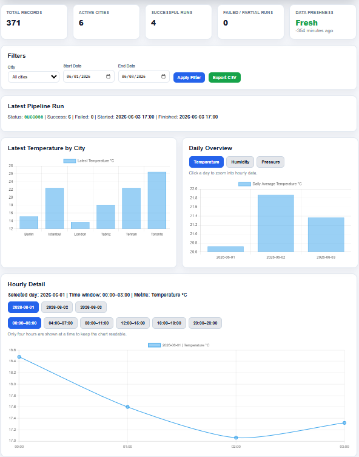
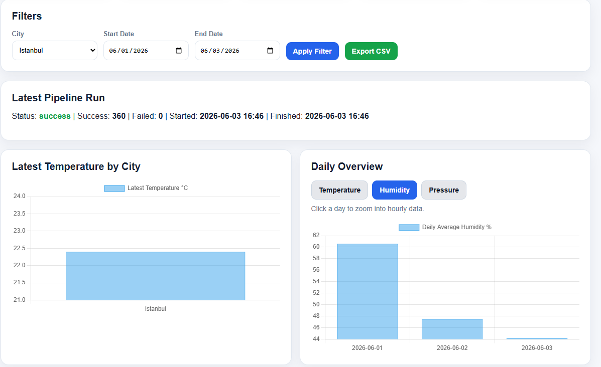
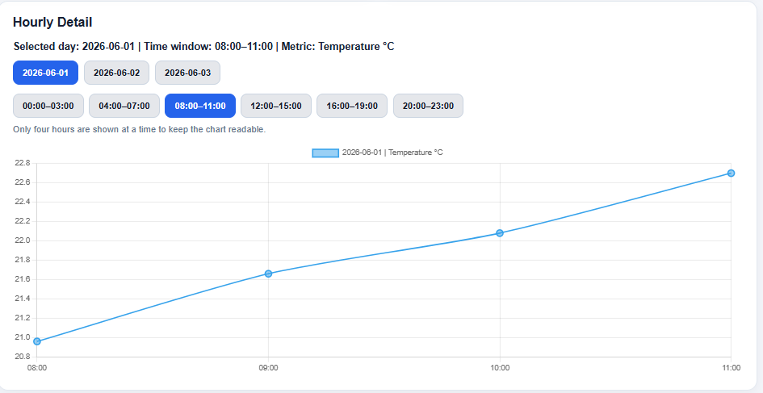
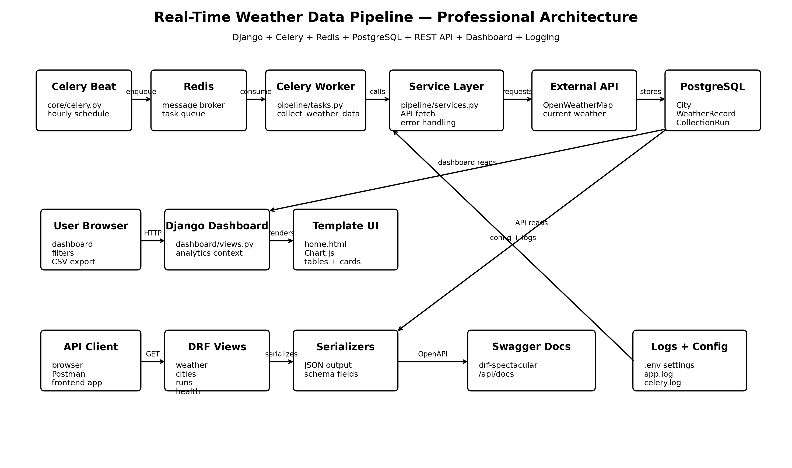

# Real-Time Weather Data Pipeline Dashboard

A portfolio-ready data engineering and backend project that collects weather data, stores it in PostgreSQL, exposes it through a REST API, and visualizes it in an interactive Django dashboard.

The system uses Django, Django REST Framework, Celery, Redis, PostgreSQL, Docker Compose, Chart.js, logging, API documentation, and historical backfilling.

---

## Preview

### Dashboard Overview



### Filtered City Dashboard



### Hourly Drill-Down View



---

## Architecture



The project is built as a small real-time data pipeline:

```text
Celery Beat
    ↓
Redis Queue
    ↓
Celery Worker
    ↓
Weather API / Historical API
    ↓
PostgreSQL
    ↓
Django Dashboard + REST API
```

---

## Project Goal

The goal of this project is to demonstrate a complete backend/data pipeline workflow:

* scheduled background data collection
* external API integration
* PostgreSQL data modeling
* asynchronous task processing with Celery
* Redis message broker
* REST API with Swagger documentation
* historical hourly data backfilling
* interactive dashboard analytics
* CSV export
* logging and error handling
* Dockerized multi-service environment

---

## Key Features

### Automated Weather Collection

The project collects current weather data automatically using Celery Beat and Celery Worker.

Celery Beat schedules the task, Redis works as the message broker, and Celery Worker executes the collection task.

---

### Historical Hourly Weather Backfill

The project supports historical hourly weather backfilling.

Example:

```bash
docker compose exec web python manage.py backfill_weather --start-date 2026-06-01 --end-date 2026-06-03
```

This collects hourly data for all configured cities and stores it in PostgreSQL.

---

### Interactive Dashboard

The dashboard includes:

* total weather records
* active city count
* successful pipeline runs
* failed / partial pipeline runs
* data freshness status
* city filter
* date range filter
* latest pipeline run status
* latest temperature by city
* daily overview chart
* hourly drill-down chart
* 4-hour time windows
* recent records table
* CSV export

The chart system is designed for readability:

1. The dashboard first shows data day by day.
2. The user can click a specific day.
3. The hourly chart zooms into that day.
4. Hourly data is split into 4-hour windows:

   * 00:00–03:00
   * 04:00–07:00
   * 08:00–11:00
   * 12:00–15:00
   * 16:00–19:00
   * 20:00–23:00

---

### REST API

The project exposes weather data through Django REST Framework.

| Endpoint                                                  | Description                    |
| --------------------------------------------------------- | ------------------------------ |
| `/api/weather/`                                           | List weather records           |
| `/api/weather/?city=Berlin`                               | Filter weather records by city |
| `/api/weather/?start_date=2026-06-01&end_date=2026-06-03` | Filter records by date         |
| `/api/cities/`                                            | List monitored cities          |
| `/api/runs/`                                              | List pipeline runs             |
| `/api/health/`                                            | Health check endpoint          |
| `/api/docs/`                                              | Swagger API documentation      |
| `/api/redoc/`                                             | ReDoc API documentation        |

---

### CSV Export

The dashboard allows exporting filtered weather data as a CSV file.

The export respects:

* selected city
* start date
* end date

---

### Pipeline Run Tracking

Each collection cycle creates a `CollectionRun` record.

It stores:

* status
* start time
* finish time
* success count
* failed count
* error message

This makes the project more realistic than a simple script-based weather dashboard.

---

## Tech Stack

| Area                  | Technology                |
| --------------------- | ------------------------- |
| Backend               | Django                    |
| API                   | Django REST Framework     |
| API Docs              | drf-spectacular / Swagger |
| Database              | PostgreSQL                |
| Background Jobs       | Celery                    |
| Scheduler             | Celery Beat               |
| Message Broker        | Redis                     |
| Dashboard             | Django Templates          |
| Charts                | Chart.js                  |
| Containerization      | Docker Compose            |
| Environment Variables | python-dotenv             |
| Logging               | Python logging            |
| Testing               | Django TestCase           |
| CI                    | GitHub Actions            |

---

## Data Model

The project uses three main models:

```text
City
CollectionRun
WeatherRecord
```

### City

Stores monitored city information.

Main fields:

```text
name
country
latitude
longitude
is_active
created_at
updated_at
```

### CollectionRun

Tracks each pipeline execution.

Main fields:

```text
status
started_at
finished_at
success_count
failed_count
error_message
```

### WeatherRecord

Stores weather measurements.

Main fields:

```text
city
collection_run
temperature
feels_like
humidity
description
wind_speed
pressure
cloudiness
source
api_timestamp
recorded_at
```

---

## Project Structure

```text
Real-Time-Data-Pipeline-Dashboard/
├── core/
│   ├── settings.py
│   ├── urls.py
│   └── celery.py
│
├── pipeline/
│   ├── models.py
│   ├── services.py
│   ├── tasks.py
│   ├── serializers.py
│   ├── views.py
│   ├── urls.py
│   └── management/
│       └── commands/
│           ├── collect_weather.py
│           └── backfill_weather.py
│
├── dashboard/
│   ├── views.py
│   └── urls.py
│
├── templates/
│   └── dashboard/
│       └── home.html
│
├── docs/
│   ├── architecture.png
│   └── screenshots/
│
├── docker-compose.yml
├── Dockerfile
├── requirements.txt
├── .env.example
├── .env.docker
├── README.md
└── manage.py
```

---

## Environment Variables

Create a local `.env` file from `.env.example`.

```bash
cp .env.example .env
```

On Windows PowerShell:

```powershell
copy .env.example .env
```

Example:

```env
SECRET_KEY=replace-this-secret
DEBUG=True
ALLOWED_HOSTS=localhost,127.0.0.1

DB_NAME=weather_pipeline
DB_USER=postgres
DB_PASSWORD=your-postgres-password
DB_HOST=127.0.0.1
DB_PORT=5432

CELERY_BROKER_URL=redis://localhost:6379/0
CELERY_RESULT_BACKEND=redis://localhost:6379/0

WEATHER_API_KEY=your-openweathermap-api-key
CITIES=London,Berlin,Istanbul,Tehran,Toronto
TIME_ZONE=UTC
```

For Docker, use `.env.docker`:

```env
SECRET_KEY=django-insecure-docker-local-dev-key
DEBUG=True
ALLOWED_HOSTS=localhost,127.0.0.1,0.0.0.0,web

DB_NAME=weather_pipeline
DB_USER=postgres
DB_PASSWORD=postgres
DB_HOST=db
DB_PORT=5432

CELERY_BROKER_URL=redis://redis:6379/0
CELERY_RESULT_BACKEND=redis://redis:6379/0

WEATHER_API_KEY=your-openweathermap-api-key
CITIES=London,Berlin,Istanbul,Tehran,Toronto
TIME_ZONE=UTC
```

Never commit real API keys or real database passwords.

---

## Running with Docker

### 1. Start Docker Desktop

Make sure Docker Desktop is running.

Check:

```bash
docker --version
docker compose version
```

### 2. Build the images

```bash
docker compose build
```

### 3. Start the services

```bash
docker compose up
```

This starts:

```text
web      Django web app
db       PostgreSQL database
redis    Redis broker
worker   Celery worker
beat     Celery Beat scheduler
```

Open the dashboard:

```text
http://localhost:8000/
```

Open Swagger docs:

```text
http://localhost:8000/api/docs/
```

Open health check:

```text
http://localhost:8000/api/health/
```

---

## Running Migrations Manually

If the database starts before migrations run correctly, execute:

```bash
docker compose exec web python manage.py migrate
```

Or run a one-off command:

```bash
docker compose run --rm web python manage.py migrate
```

---

## Collect Current Weather Manually

```bash
docker compose exec web python manage.py collect_weather
```

This collects current weather for all active cities.

---

## Backfill Historical Hourly Weather

Example:

```bash
docker compose exec web python manage.py backfill_weather --start-date 2026-06-01 --end-date 2026-06-03
```

This fills the database with hourly data for all configured cities.

---

## Run the Dashboard

```text
http://localhost:8000/
```

Use the filters to choose:

* city
* start date
* end date

Use the daily overview chart to select a day, then explore hourly data in 4-hour windows.

---

## API Usage Examples

### Get all weather records

```bash
curl http://localhost:8000/api/weather/
```

### Filter by city

```bash
curl "http://localhost:8000/api/weather/?city=Berlin"
```

### Filter by date range

```bash
curl "http://localhost:8000/api/weather/?start_date=2026-06-01&end_date=2026-06-03"
```

### Get cities

```bash
curl http://localhost:8000/api/cities/
```

### Get pipeline runs

```bash
curl http://localhost:8000/api/runs/
```

### Health check

```bash
curl http://localhost:8000/api/health/
```

---

## Run Tests

```bash
python manage.py test
```

With Docker:

```bash
docker compose exec web python manage.py test
```

---

## Logging

Application logs are written to:

```text
logs/app.log
logs/celery.log
```

The logs include:

* dashboard requests
* CSV export requests
* weather collection task start/finish
* API errors
* pipeline run status
* Celery task retries

---

## Common Docker Commands

### Start services

```bash
docker compose up
```

### Start services in background

```bash
docker compose up -d
```

### Stop services

```bash
docker compose down
```

### Stop and delete database volume

```bash
docker compose down -v
```

### View logs

```bash
docker compose logs -f
```

### View only Celery logs

```bash
docker compose logs -f worker beat
```

### Run Django shell

```bash
docker compose exec web python manage.py shell
```

---

## Troubleshooting

### PostgreSQL starts too slowly

If you see:

```text
FATAL: the database system is starting up
```

wait a few seconds and run:

```bash
docker compose exec web python manage.py migrate
```

Then restart:

```bash
docker compose restart web worker beat
```

---

### Table does not exist

If you see:

```text
relation "pipeline_city" does not exist
```

run:

```bash
docker compose exec web python manage.py migrate
```

Then restart Celery:

```bash
docker compose restart worker beat
```

---

### Port 5432 is already used

If you already have PostgreSQL installed locally, change the database port mapping in `docker-compose.yml`:

```yaml
ports:
  - "5433:5432"
```

Do not change `.env.docker`.

Inside Docker, keep:

```env
DB_HOST=db
DB_PORT=5432
```

---

### Docker Hub download timeout

If Docker fails while pulling images, retry:

```bash
docker pull python:3.13-slim
docker pull postgres:16-alpine
docker pull redis:7-alpine
```

Then:

```bash
docker compose up
```

---

## Security Notes

Before pushing to GitHub:

* do not commit `.env`
* do not commit real `.env.docker` secrets
* rotate any API key that was exposed during development
* keep `.env.example` as the public template

---

## Portfolio Summary

This project demonstrates how to build a real-time weather data pipeline using Django, Celery, Redis, PostgreSQL, Docker, and Django REST Framework.

It includes automated background jobs, historical hourly backfilling, structured pipeline run tracking, REST API documentation, CSV export, and an interactive analytics dashboard.

---

## Future Improvements

* add authentication for dashboard access
* add Prometheus/Grafana monitoring
* add city management from the dashboard
* improve Celery startup dependency with health checks
* deploy to a cloud platform
* add frontend framework version with React or Next.js
* add map visualization for city locations
